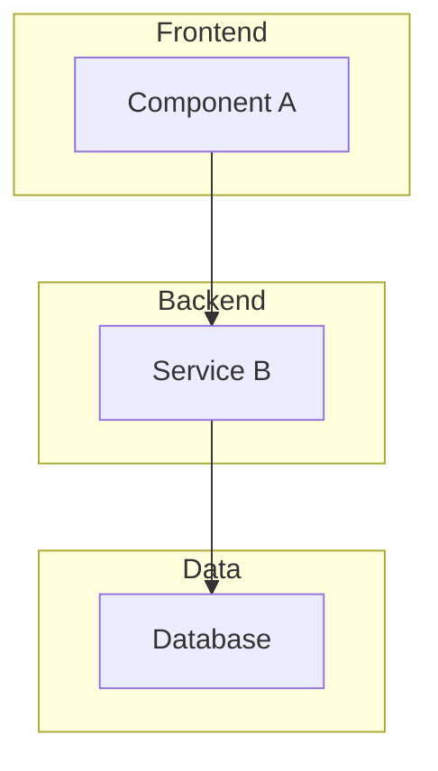

# {{FEATURE_NAME}}

## Overview

<!-- 技术实现方案简述（聚焦实现，非架构）、关键目标和范围 -->

## Technical Decisions

<!-- 具体技术选型决策 + 理由，例如：
- 选 MyBatis 而非 JPA：因为项目已有 MyBatis 基础设施
- 选 Redis 而非本地缓存：因为多实例部署需要共享状态
-->

## System Overview



<!-- Mermaid 图仅作辅助，重点在下方 Technical Details 中的具体 API、数据模型和业务逻辑 -->

## Technical Details

<!-- ⚠️ 这是 Epic 的核心 section，必须包含具体的技术实现细节 -->

### API 端点列表

<!-- 完整列出所有 API (PRD ref: ...)
| Method | Endpoint | Description | Request | Response |
|--------|----------|-------------|---------|----------|
| POST   | /api/v1/xxx | 功能描述 | {params} | {schema} |
-->

### 数据模型

<!-- 完整列出所有数据表 (PRD ref: ...)
```sql
CREATE TABLE table_name (
  id BIGINT PRIMARY KEY AUTO_INCREMENT COMMENT 'Primary key',
  -- Business fields
  field_name TYPE [NOT NULL] [DEFAULT x] COMMENT 'Field description',
  -- Audit fields
  created_at DATETIME DEFAULT CURRENT_TIMESTAMP,
  updated_at DATETIME ON UPDATE CURRENT_TIMESTAMP,
  INDEX idx_xxx (field1) COMMENT 'Index purpose'
) COMMENT='Table description';
```
-->

### 业务逻辑实现方案

<!-- 具体的业务逻辑描述（代码级），包括：
- 关键算法和流程
- 接口定义（类/函数签名）
- 校验规则和错误处理
(PRD ref: ...)
-->

### Frontend Components
<!-- UI 组件、状态管理、交互模式 (PRD ref: ...) -->

### Infrastructure
<!-- 部署、扩展、监控（简要） -->

## Implementation Strategy

### Phases
<!-- 开发阶段、风险缓解、测试方案 -->

## Task Breakdown Preview

### Phase 1: [Name] (Est: X hours)
- [ ] 001 - [Task Title]
  - [Deliverables]
  - **PRD Coverage:** [Which requirements/stories]
  - Effort: [Size estimate]

### Phase 2: [Name] (Est: X hours)
- [ ] 002 - [Task Title]
  - [Deliverables]
  - **PRD Coverage:** [Which requirements/stories]
  - Effort: [Size estimate]

## Dependencies

<!-- 外部服务、内部团队、前置工作、潜在阻碍 -->

## Success Criteria (Technical)

<!-- 性能基准、质量门、可测试验收标准、非功能需求 -->
