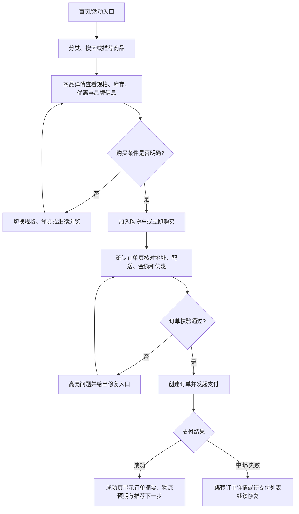
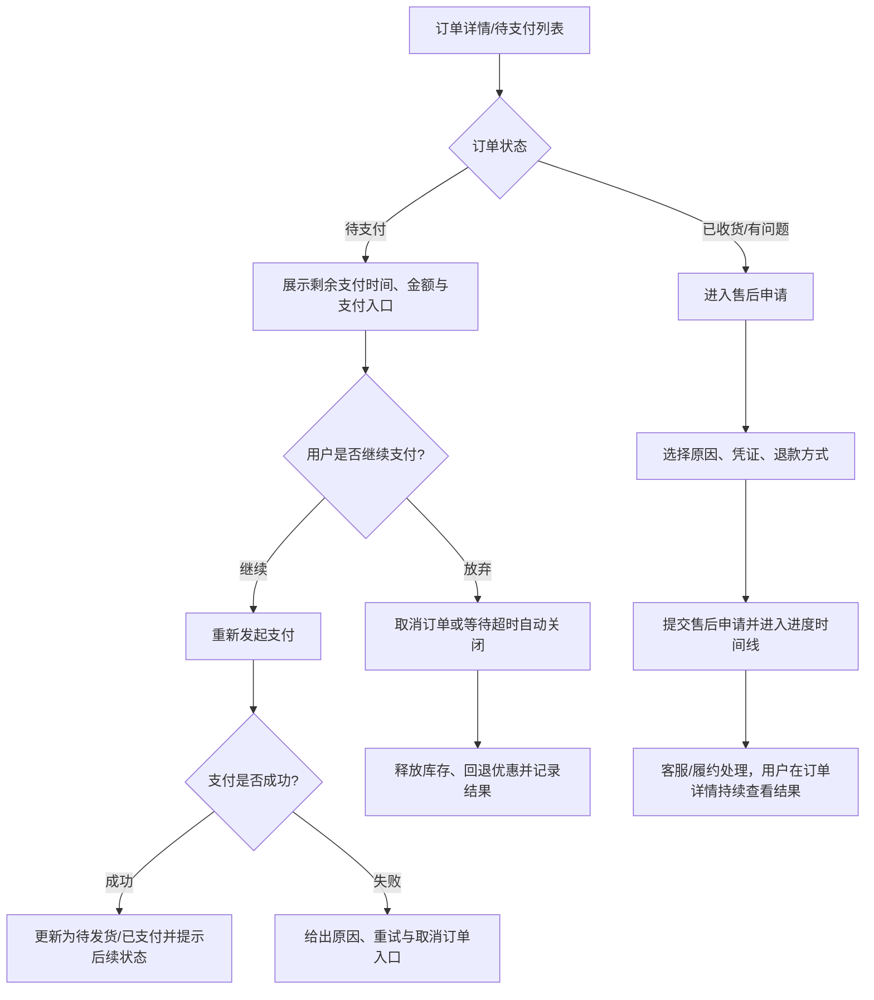
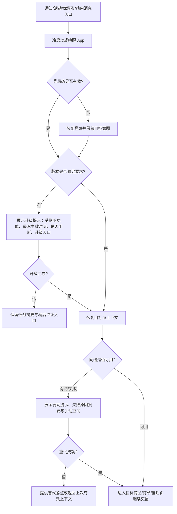
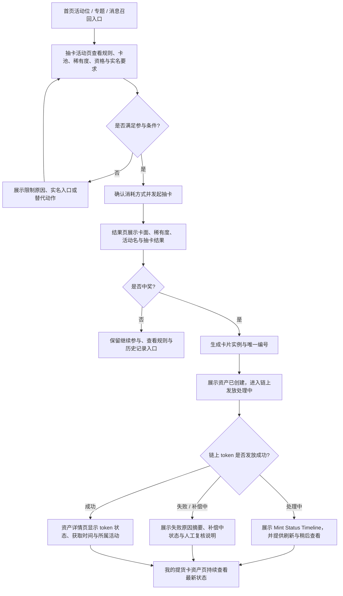
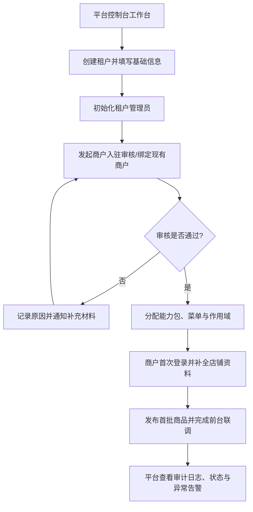

---
stepsCompleted:
  - 1
  - 2
  - 3
  - 4
  - 5
  - 6
  - 7
  - 8
  - 9
  - 10
  - 11
  - 12
  - 13
  - 14
lastStep: 14
inputDocuments:
  - _opcos/planning-artifacts/1-new-feature/prd.md
  - _opcos/project-context.md
  - docs/index.md
  - docs/project-overview.md
  - docs/backend/README.md
  - docs/frontend/README.md
  - docs/mobile/README.md
  - docs/api/README.md
prd_dir: 1-new-feature
project_name: ai_flutter_client
user_name: David
date: '2026-03-19T22:34:26+0800'
lastUpdated: '2026-03-20T17:13:30+0800'
status: complete
---

# UX Design Specification ai_flutter_client

**Author:** David  
**Date:** 2026-03-19T22:34:26+0800  
**Last Updated:** 2026-03-20T17:13:30+0800  
**Revision Focus:** 对齐最新 PRD 的移动端 App 召回、弱网、权限、升级提示与提货卡抽赏链路要求。

---

## Executive Summary

### Project Vision

Zero-Admin 的 UX 目标不是单纯把已有后台和商城页面“重新画漂亮”，而是把平台管理员、租户开通负责人、商户运营、消费者、客服与技术运营这几类角色拉回到同一条清晰的体验主线里。这个主线可以概括为一句话：任何人都应在正确的业务作用域内，看清当前状态、完成关键决策，并立刻得到可信反馈。对消费者来说，这意味着从发现商品到支付成功、订单恢复、消息召回继续交易和售后申请的连续体验；对运营和管理员来说，这意味着从列表检索到配置落地、从异常定位到补偿处理的连续体验。

本次 UX 设计将围绕“平台控制台 + 商户经营后台 + 消费者移动端 App”的一体化体验来定义设计规范。当前 brownfield 的移动端实现基线仍是 Flutter 商城端，但本规范在产品体验层不把具体实现框架写死。我们不会把前台交易体验和后台运营体验拆成互不相干的两套语言，而是通过统一的状态语义、统一的视觉 token、统一的反馈模式和统一的作用域表达，把多端体验收束成一个可以被研发、测试、运营共同使用的产品体验基线。

### Target Users

- **平台管理员 / 租户开通负责人**：负责租户创建、商户审核、能力启停、权限边界与治理策略，希望高密度信息可读、作用域风险可见、关键动作可审计。
- **商户管理员 / 店铺运营**：负责商品、库存、订单、营销、内容与售后，希望任务路径短、列表检索高效、配置结果可预期。
- **消费者**：使用消费者移动端 App 完成浏览、搜索、加购、领券、下单、支付、订单查询、消息召回后的继续交易与售后，希望价格、库存、权益和状态始终一致。
- **客服 / 履约角色**：需要快速定位订单、支付、退款、物流与售后问题，希望用统一视图完成问题判断和处置。
- **技术运营 / 研发**：关心搜索同步、补偿链路、支付回调、跨端一致性与作用域隔离，希望 UI 能显性暴露系统状态和异常入口，而不是把问题埋在日志里。

### Key Design Challenges

- **多角色多作用域复杂度高**：平台、租户、商户三级边界不能混淆，否则就是治理事故而不是普通交互瑕疵。
- **交易链路必须让人相信**：价格、库存、优惠、支付、售后任一节点表达不清，用户会立刻失去信任。
- **后台需要高密度但不能高噪音**：运营侧页面天然是表格、筛选、批量操作密集型界面，但仍需保持优先级清晰。
- **前后台必须说同一种“状态语言”**：商城端的订单状态、后台的工单/补偿状态、搜索同步状态都要可对应、可解释。
- **brownfield 约束明显**：现有 React + Ant Design Pro 与 Flutter 双端技术栈已形成现实边界，UX 必须偏向可演进而非推倒重来。

### Design Opportunities

- **作用域优先的界面框架**：把“当前主体是谁、操作将影响谁”做成所有关键页面的第一层信息，而不是隐藏在面包屑或接口字段里。
- **可信确认流**：把商品详情、确认订单、支付、订单恢复、售后这些高风险节点设计成连续、可回溯、可修复的体验。
- **运营任务工作台化**：让高频后台任务从“看表找按钮”升级为“先筛选、再聚焦、后处理”的节奏化操作体验。
- **统一 token 驱动多端**：Web 后台与消费者移动端共享品牌语义、状态色、组件层级和反馈规则，降低跨端认知成本。

## Core User Experience

### Defining Experience

这个产品的高层核心体验不是某一个单页面，而是“**在明确上下文里完成一次高价值商业确认**”。消费者确认的是“这件商品现在可以买、我愿意支付”；商户确认的是“这次配置会影响我的店铺并且立即生效”；平台管理员确认的是“这次治理动作只作用于目标租户或商户且可审计”。因此，所有 UX 设计都应围绕“看清范围、做出选择、获得可信结果”展开。

### Platform Strategy

- **Web 管理端**：以桌面优先的高密度运营工作台为核心，适配平台管理员、商户管理员、客服与配置角色。
- **消费者移动端 App**：以移动优先的交易闭环为核心，重点优化发现商品、比较信息、完成支付、消息召回继续交易和订单恢复。
- **统一服务语义**：虽然当前 brownfield 基线分别是 React 管理端与 Flutter 商城端，但产品体验层要共用统一的订单、商品、优惠、权限、异常状态语义。
- **交互输入模式**：后台以鼠标/键盘效率和批量操作为主；商城端以触控、底部操作区和即时反馈为主。
- **召回与恢复策略**：把冷启动、登录态恢复、前后台切换、消息/活动唤回和弱网重试视为交易主路径的一部分，而不是边缘异常。

### Effortless Interactions

- 消费者在商品详情页应一眼看清规格、库存、价格、优惠与配送影响，不必在多个入口来回确认。
- 确认订单页要默认带出地址、优惠、可用支付方式和金额拆分，让“核对”而不是“重新填写”成为主任务。
- 用户从消息、活动或优惠券通知唤回 App 后，即使经历冷启动、登录恢复或弱网，也应保留目标页意图。
- 后台列表页的筛选、批量操作、状态切换、详情查看要保持统一结构，降低跨模块切换成本。
- 所有跨作用域页面都应显式展示“当前平台/租户/商户上下文”，并在切换时给出结果影响提示。
- 异常恢复动作必须近在手边，例如重新支付、取消订单、释放库存后的状态刷新、售后查看入口等。

### Critical Success Moments

- **消费者首单成功**：第一次从首页或活动页进入商品详情并顺利支付成功，是商城体验的第一价值证明。
- **订单恢复成功**：未支付订单能被重新唤起、取消或自动关闭并解释清楚，是信任是否建立的关键节点。
- **消息召回继续交易成功**：通知、活动或优惠券入口把用户带回正确上下文，并在必要登录或升级后仍不丢目标，是移动端留存和转化的关键节点。
- **提货卡到账成功**：抽卡后能立即看到中奖结果、唯一编号与链上 token 状态，并在处理中或补偿中保持可解释，是提货卡营销是否可信的关键节点。
- **商户首次上架成功**：商户后台第一次把商品发布到可见商城，是运营工作台是否可信的关键时刻。
- **平台首次开通成功**：租户创建、管理员初始化、首个商户绑定一气呵成，决定平台治理体验是否可规模化。
- **客服首个问题单定位成功**：能在一个详情视图中看见状态、日志和补偿线索，决定后台是否真正适合生产使用。

### Experience Principles

- **先显示作用域，再允许操作。**
- **状态必须可见、可解释、可恢复。**
- **把关键路径设计成核对流程，而不是填空流程。**
- **高频页面优先保证节奏与效率，低频页面优先保证理解与确定性。**
- **复用熟悉模式，在关键节点做最少但有效的创新。**
- **登录、升级、授权这些系统门槛必须让位于主任务，并在完成后回到原上下文。**

## Desired Emotional Response

### Primary Emotional Goals

- **消费者**：感到安心、可信、顺滑，尤其在规格选择、金额确认、消息召回、支付恢复与售后阶段不产生“会不会出错”的焦虑。
- **商户与运营人员**：感到掌控、有条理、效率高，愿意长时间在后台工作而不被噪音和不确定性消耗。
- **平台管理员**：感到权责边界清晰，执行治理动作时有把握，不担心误伤其他主体。

### Emotional Journey Mapping

| 阶段 | 用户期望情绪 | 设计目标 |
| --- | --- | --- |
| 首次进入 | 清晰、被引导 | 让用户快速建立“我现在在哪、能做什么”的认知 |
| 核心操作中 | 专注、可控 | 让信息层级稳定，避免突兀跳转和重复确认 |
| 遇到异常 | 被保护、可恢复 | 告诉用户发生了什么、影响什么、下一步能做什么 |
| 完成任务后 | 成就、放心 | 通过结果页、状态更新和下一步建议强化成功感 |
| 再次回访 | 熟悉、省心 | 保持入口、标签、状态语义一致，降低重新学习成本 |

### Micro-Emotions

- **信心 vs 困惑**：通过明确的作用域标识、结构化表单和结果反馈，把“我能不能这样做”变成“我知道这样做会发生什么”。
- **信任 vs 怀疑**：通过一致的金额、库存、状态、日志表达，消除“前台看到一套、后台看到另一套”的怀疑感。
- **效率感 vs 被拖慢**：通过默认值、批量动作、就地编辑和分层详情，减少用户来回跳页和重复输入。
- **被照顾感 vs 被抛下**：通过异常恢复、空状态指引、售后入口和支付重试，避免用户在出错时无从下手。
- **连续性 vs 丢失感**：通过保留唤回意图、登录恢复后的原路返回和弱网重试，让用户感觉“我是在继续刚才那件事”，而不是被迫重新开始。

### Design Implications

- **安心** → 关键状态用时间线、标签和金额明细可视化，不隐藏交易后果。
- **掌控** → 让筛选条件、作用域和批量动作始终处在视野范围内，减少“我现在到底在处理谁”的疑惑。
- **顺滑** → 优先使用抽屉、底部弹层和就地反馈，避免不必要的全页跳转。
- **恢复感** → 任何失败都至少给出一个明确恢复动作，而不是只弹出错误 toast。
- **连续性** → 冷启动、登录恢复、升级完成和网络恢复后都优先回到原目标页，其次才是回首页。

### Emotional Design Principles

- 用稳定结构建立信任，而不是用过度装饰制造“高级感”。
- 在高风险节点减少惊喜，在低风险节点增加愉悦细节。
- 把系统“为什么这样”解释给用户听，而不是只告诉他们“失败了”。
- 让重复用户感到熟悉，让首次用户感到被照顾。

## UX Pattern Analysis & Inspiration

### Inspiring Products Analysis

- **京东 App**：值得借鉴的是商品详情与订单状态的确定性表达。价格、配送、库存、售后与订单状态被明确放在高关注区，能显著降低购买焦虑。
- **淘宝/天猫商家后台**：值得借鉴的是复杂经营任务的模块化拆解。筛选、列表、详情、批量动作之间的关系清晰，适合长时间运营工作。
- **Shopify Admin / Ant Design Pro 工作台模式**：值得借鉴的是“列表主导 + 详情抽屉/表单”的管理节奏，能很好支持商品、订单、营销等高频后台任务。
- **飞书类高密度企业工具**：值得借鉴的是信息密度高但层级仍清晰的布局方法，以及状态标签、通知、任务提醒的统一语义。

### Transferable UX Patterns

- **导航模式**：后台采用左侧一级导航 + 页面级页头 + 局部标签页的三层结构，商城端采用底部主导航 + 页面内分段入口。
- **交互模式**：高频运营任务优先用列表、抽屉、批量工具条和结果 toast；交易关键流优先用底部吸附动作栏、步骤确认和状态页。
- **视觉模式**：主操作区域突出，辅助信息折叠；状态标签颜色统一；金额、时间、主体、状态始终用固定视觉位置呈现。
- **异常恢复模式**：支付失败、校验失败、库存不足、越权、作用域冲突都应提供“解释 + 修复入口 + 后续影响”。
- **意图保留模式**：消息、活动、优惠券和待支付入口带来的目标意图要跨越启动、登录、升级和弱网重试被稳定保留。

### Anti-Patterns to Avoid

- 把平台、租户、商户上下文藏在页面深处，导致用户误以为自己在操作另一主体。
- 在交易关键流里堆叠过多营销信息，挤压规格、金额、库存和支付确认这些主任务信息。
- 后台页面所有操作都用同等级按钮表达，导致真正危险动作和普通保存动作没有区分。
- 仅靠 toast 告知错误，缺少就地高亮、修复入口和状态留痕。
- 把移动端当成桌面端缩略图处理，而不是基于触控和底部动作逻辑重新组织信息。

### Design Inspiration Strategy

- **直接采用**：后台列表-筛选-详情抽屉的成熟模式、商城详情页的信任信息布局、订单状态时间线。
- **有节制地改造**：在成熟模式上加入 Zero-Admin 独有的作用域条、权限边界提示、搜索同步/补偿状态提示。
- **明确避免**：重营销轻交易的前台噪音布局、重表单轻结果的后台操作流、跨端状态语义不一致。

## Design System Foundation

### 1.1 Design System Choice

本项目采用 **“既有成熟系统 + 跨端 token 化扩展”的混合设计系统方案**：

- **Web 管理端**：继续以 Ant Design Pro / Ant Design 作为基础组件系统。
- **消费者移动端 App**：以现有移动端组件基线为实现载体，但不直接追求框架默认视觉，而是通过共享 token 建立商业品牌感。
- **跨端层**：建立统一的语义 token 层，负责颜色、圆角、阴影、间距、状态色、标签层级和反馈语义映射。

### Rationale for Selection

- 当前仓库已经深度绑定 Ant Design Pro 与现有移动端组件结构，继续复用能显著降低 UX 到实现的落差。
- 后台是高密度运营产品，成熟系统对表格、表单、抽屉、导航、权限页的支撑最强。
- 商城端需要更强品牌调性和购买氛围，因此不适合完全照搬后台组件语感，需要基于同一 token 做不同终端表达。
- 项目属于 brownfield，高优先级是统一体验和提高可信度，而不是从零打造重型自研组件库。

### Implementation Approach

- 建立一套跨端语义 token：`brand / accent / success / warning / danger / scope / surface / border / text`。
- Web 保留 Ant 组件结构与交互习惯，通过主题 token、页面模板和自定义业务组件统一体验。
- 移动端 App 围绕首页、详情、确认订单、订单详情、售后、消息唤回与上下文恢复等高频页面建立专用 commerce 组件层。
- 所有状态表达都使用同一套命名与颜色规则，保证“待支付 / 已支付 / 已取消 / 售后中 / 已同步”等状态跨端一致。
- 将加载态、空态、错误态、弱网态、权限说明与升级提示沉淀为统一状态壳层，避免移动端关键页面各自发挥。

### Customization Strategy

- **品牌层**：通过“控制蓝 + 交易珊瑚橙 + 信任绿”的组合建立平台治理与消费转化兼容的视觉气质。
- **密度层**：后台使用中高密度布局，商城端使用舒展卡片与底部动作栏。
- **语义层**：所有作用域、权限、异常、交易状态使用强语义组件封装，不允许页面各自发挥。
- **可扩展层**：优先沉淀“作用域条、状态时间线、金额拆分卡、批量工具栏、优惠券面板”等业务组件。

## 2. Core User Experience

### 2.1 Defining Experience

Zero-Admin 的定义性体验可以命名为 **“可信确认流”**：用户在一个持续可理解的上下文中，完成一次影响业务结果的关键确认，并在每个节点都知道当前条件、后果与下一步。

它在不同角色上的具体体现为：

- **消费者**：从商品详情到支付成功的一次连续购买确认流。
- **商户运营**：从列表筛选到配置保存并看到生效结果的一次连续运营流。
- **平台管理员**：从主体选择到治理动作完成并留下审计记录的一次连续治理流。

### 2.2 User Mental Model

- **消费者的 mental model**：我先看值不值得买，再确认有没有货、有没有优惠、能不能顺利支付，最后关心订单会不会出问题。
- **消费者的恢复 mental model**：如果我从消息或活动回来，我想继续刚才那件事，而不是重新找入口；如果系统要求登录、升级或授权，它应该帮我回到原目标。
- **商户的 mental model**：我先找到自己的商品/订单/活动，再执行编辑或处理动作，最后确认是否已经影响到我的店铺。
- **平台管理员的 mental model**：我先确认当前是在平台、租户还是商户层，再决定是否授权、启停、审核或回收能力。
- **客服/履约的 mental model**：我需要一个可以串起订单、支付、退货、地址和日志的统一问题单视图。

### 2.3 Success Criteria

- 用户在任何关键操作开始前都能看见当前主体与影响范围。
- 用户在任何关键操作提交前都能看见核心校验信息，而不是提交后才发现问题。
- 结果反馈必须告诉用户“是否成功、影响了什么、下一步能做什么”。
- 失败不应让用户被迫从头再来，至少保留当前上下文并提供恢复路径。
- 高频任务应在熟悉后的两到三次点击/触控内进入主操作状态。
- 移动端用户在冷启动、登录恢复、弱网重试和消息唤回后仍能看见原目标或明确替代落点。

### 2.4 Novel UX Patterns

- **不是重新发明电商流程，而是把成熟流程做得更可信。**
- 采用成熟的列表、抽屉、底部操作栏、步骤确认、订单时间线等模式，减少学习成本。
- 在此基础上加入三类增强模式：
  - **作用域 Context Bar**：持续显示当前平台/租户/商户上下文与风险级别。
  - **Consequence Preview**：提交前展示本次操作将影响的数据对象、数量与状态。
  - **Recovery-first Feedback**：异常反馈不只报错，还给修复动作和回退线索。
  - **Intent Recovery Loop**：消息唤回、登录恢复、版本升级和权限授权完成后，系统自动回到原目标页或明确给出替代落点。

### 2.5 Experience Mechanics

1. **Initiation**
   - 后台：从导航、搜索或告警入口进入任务页面，页头先建立上下文和任务目标。
   - 商城：从首页、分类、搜索、消息、活动、通知或待支付恢复入口进入商品或订单上下文。
2. **Interaction**
   - 用户优先通过筛选、规格、优惠、状态标签和摘要信息进行判断，再做动作。
   - 系统提供就地编辑、底部操作区、抽屉详情和渐进披露，减少无意义跳页。
3. **Feedback**
   - 成功时给出结果摘要、状态更新和下一步建议。
   - 失败时给出问题来源、影响范围、修复入口和保留上下文；若触发登录、权限或升级门槛，完成后仍返回原任务。
4. **Completion**
   - 消费者完成购买、召回后的继续交易或恢复；运营完成配置或处置；管理员完成治理动作并看到审计线索。
   - 完成页要具备“继续相关任务”的路径，而不是只给一个关闭按钮。

## Visual Design Foundation

### Color System

建议建立如下语义色体系：

- **Brand / Control Blue**：`#1F5EFF`，用于主要导航、平台级主按钮、关键链接和信息强调。
- **Commerce Coral**：`#FF6B4A`，用于商城端主购买动作、营销主 CTA 和关键转化入口。
- **Trust Green**：`#18A957`，用于支付成功、同步成功、可恢复完成、库存正常等正向状态。
- **Warning Amber**：`#F4A321`，用于待处理、风险提醒、库存紧张、配置未发布等中性风险。
- **Danger Crimson**：`#D64545`，用于删除、停用、越权、支付失败、补偿异常等高风险状态。
- **Scope Indigo**：`#5B4BDB`，用于区分租户/商户上下文和跨主体提示。
- **Neutral Slate**：从 `#0F172A` 到 `#F8FAFC` 构建 8 级中性色，用于背景、分割线、正文和次级信息。

色彩应用原则：

- 后台主色偏稳重、清晰，商城转化动作允许更温暖、更具购买冲动。
- 同一状态语义不因终端不同而换色。
- 彩色只服务于语义，不用于无意义装饰。

### Typography System

- **Heading 字体建议**：`"Manrope", "Noto Sans SC", "PingFang SC", sans-serif`，用于标题和关键数字，强调现代、精确和节奏感。
- **Body 字体建议**：`"Noto Sans SC", "PingFang SC", "Microsoft YaHei", sans-serif`，保证中文阅读稳定性。
- **后台字号层级**：
  - H1: 32/40
  - H2: 24/32
  - H3: 20/28
  - Body L: 16/24
  - Body M: 14/22
  - Meta: 12/18
- **商城端字号层级**：
  - Page Title: 28/34
  - Section Title: 20/28
  - Body: 15/24
  - Price Emphasis: 24/28, 半粗体
  - Meta: 12/18

### Spacing & Layout Foundation

- 采用 **8px 基础栅格**，关键内边距使用 16 / 24 / 32 的倍数。
- 后台页面以 **12 栏内容网格 + 左侧固定导航 + 页头操作区** 为主。
- 商城端使用 **全宽卡片 + 分段模块 + 吸附底部操作栏** 的结构。
- 所有高价值信息块优先用卡片、分组、分隔与层级文字组织，而不是靠背景色堆叠。
- 页面布局默认遵循“上下文 → 摘要 → 主任务 → 辅助信息”的视觉节奏。

### Accessibility Considerations

- 正文字体对比度至少满足 WCAG AA，普通文本对比度不低于 4.5:1。
- 颜色不单独承载状态，必须配合图标、文字或标签。
- 所有关键点击目标保证至少 44x44px 触控区域。
- 后台页面完整支持键盘可达、焦点可见和表单错误就地提示。
- 消费者移动端 App 支持系统字体放大，不让价格和按钮在大字号下错位失真。
- 弱网提示、权限说明、升级提示和消息唤回失败反馈都必须保留简洁正文、主次动作和可读屏标签。

## Design Direction Decision

### Design Directions Explored

本轮设计方向探索聚焦 6 个视觉与布局方向：

1. **Command Center Dense Grid**：强调后台密度、监控感和批量操作效率。
2. **Card-led Commerce Dashboard**：强化商城端卡片化、营销氛围和转化动线。
3. **Scope-first Split Pane**：以作用域和详情并列布局强化平台治理与订单处理。
4. **Guided Task Workspace**：以任务引导、步骤条和结果确认强化复杂流程。
5. **Signal-driven Monitoring View**：强化搜索同步、补偿、异常告警等系统状态感知。
6. **Mobile Commerce Studio**：强化消费者移动端 App 首页、详情、购物车、订单和召回恢复场景的移动交易节奏。

### Chosen Direction

最终建议采用 **Direction 3「Scope-first Split Pane」作为主骨架，融合 Direction 4「Guided Task Workspace」作为复杂流程的增强层**。

这意味着：

- 后台以“列表/概览在左，详情/处理在右”的双栏节奏呈现高频任务。
- 复杂任务如租户开通、订单异常恢复、售后审核、营销配置使用步骤化或阶段化工作流呈现。
- 商城端则沿用清晰的移动交易节奏，但共享相同的状态语义和结果表达。

### Design Rationale

- 它最适合 Zero-Admin 的多主体治理需求，能持续提醒用户当前作用域。
- 它比单纯大表格更容易承载订单详情、售后进度、日志、补偿结果等上下文。
- 它比纯卡片化后台更适合长时间运营工作，不会牺牲批量效率。
- 它可以和现有 Ant Design Pro 页面结构自然衔接，落地阻力最小。

### Implementation Approach

- 后台工作台页面优先沉淀为“筛选区 + 列表区 + 详情抽屉/侧栏 + 固定动作栏”模板。
- 商城端高频页面优先沉淀为“摘要卡片 + 分段内容 + 底部吸附 CTA + 状态页”模板。
- 设计方向展示产物见：
  - `_opcos/planning-artifacts/ux-design-directions.html`
  - `_opcos/planning-artifacts/ux-color-themes.html`

## User Journey Flows

### 消费者首单成交流

目标是让消费者从“看到商品”自然进入“放心支付”，并把所有高风险信息前置到正确节点。

### 未支付恢复与售后流

目标是把异常恢复和售后申请纳入同一套“可追踪、可恢复、可解释”的状态体验中。

### 消息召回、弱网与上下文恢复流

目标是把通知、活动或优惠券唤回真正转化为“继续刚才那件事”，并确保登录恢复、升级提示和弱网重试都不会把用户抛回起点。

### 提货卡抽赏与链上资产到账流

目标是把“抽中结果”设计成一条可信资产链路，而不是一次转瞬即逝的营销动画，确保用户能持续确认卡片确已归属自己。

### 平台开通与商户治理流

目标是把平台级治理动作做成明确的主体流，不让管理员在多个后台与脚本之间跳转。

### Journey Patterns

- 所有关键流都从“建立上下文”开始，而不是直接让用户填表或点提交。
- 每个关键决策前都应给出摘要信息，避免用户跳回前一步补确认。
- 所有异常都要求“说明原因 + 给出恢复动作 + 保留当前上下文”。
- 完成态不是终点，还要给“下一步最合理动作”。
- 召回流以“保留目标意图”为最高优先级，系统门槛不能把用户静默送回首页。
- 资产型营销必须把“结果页可信”放在“动效惊喜”之前，中奖结果、唯一编号和链上状态必须来自服务端确认，而不是客户端自行拼装。

### Flow Optimization Principles

- 优先减少来回跳页，其次才是减少按钮数。
- 一次只让用户处理一种主要决策，不把多种高风险动作堆在一个区域。
- 用固定位置的金额、状态、主体、时间信息建立熟悉感。
- 对高频用户优化速度，对首次用户优化解释。
- 登录、升级、权限授权与弱网重试都要串成一条回到原任务的链路，而不是独立死胡同。
- 对提货卡场景优先优化“已中奖但未完全到账”的解释力，避免把处理中、补偿中、冻结中误渲染为失败或成功。

## Component Strategy

### Design System Components

**Web 基础组件优先复用：**

- `PageContainer`、`ProTable`、`ProForm`、`Drawer`、`Modal`
- `Tabs`、`Steps`、`Descriptions`、`Tag`、`Result`
- `Alert`、`Notification`、`Dropdown`、`Tooltip`

**移动端 App 基础组件优先复用（当前 brownfield 基线为 Flutter）：**

- 页面级 `Scaffold` / `AppBar` / `TabBar`
- 底部弹层、底部操作区、列表与卡片容器
- 状态页、加载骨架、消息提示、地址/优惠券选择弹层
- 网络状态条、意图恢复壳层、升级提示页、权限说明弹层

### Custom Components

#### Scope Context Bar

**Purpose:** 固定展示当前平台/租户/商户主体、权限级别和影响范围。  
**Usage:** 出现在所有高风险后台页面页头。  
**States:** 默认、跨主体切换中、权限受限、主体停用。  
**Accessibility:** 作用域信息可被读屏直接朗读，切换后触发状态更新提示。

#### Order Timeline Panel

**Purpose:** 用时间线串起订单、支付、发货、售后、补偿等状态。  
**Usage:** 订单详情、售后详情、客服问题定位页。  
**States:** 正常推进、待处理、异常、人工介入、已完成。  
**Accessibility:** 时间点、状态和说明必须有文本，不仅是彩色圆点。

#### Price Breakdown Card

**Purpose:** 稳定展示商品金额、优惠、运费、积分、实付金额的拆分逻辑。  
**Usage:** 商品详情摘要、确认订单、订单详情、售后退款页。  
**States:** 默认、优惠变更、库存/价格失效、退款中。  
**Accessibility:** 金额变化要可读、可聚焦，重要变化有文本说明。

#### Promotion Stack & Coupon Sheet

**Purpose:** 用统一结构承载优惠券、满减、秒杀、活动推荐。  
**Usage:** 商品详情、购物车、确认订单页。  
**States:** 可领、已领、已使用、不可用、即将过期。  
**Accessibility:** 活动规则可展开阅读，状态标签与时间信息同时可见。

#### Commerce State Shell

**Purpose:** 统一移动端关键页面的加载态、空态、错误态和弱网态表达。  
**Usage:** 首页、分类、搜索、商品详情、购物车、确认订单、订单列表/详情、售后申请页。  
**States:** 初次加载、空结果、请求失败、超时、弱网恢复中。  
**Accessibility:** 状态文案、失败原因摘要和重试入口必须可读屏，不能只有插图或骨架。

#### Intent Recovery Loop

**Purpose:** 保存并恢复通知、活动、优惠券、待支付订单等入口带来的目标意图。  
**Usage:** App 冷启动、热启动、登录恢复、前后台切换、消息唤回和支付恢复场景。  
**States:** 恢复中、已恢复、目标失效、替代落点已提供。  
**Accessibility:** 恢复结果必须以文本说明当前将进入的页面或失败原因，不允许静默跳转。

#### Permission Request Sheet

**Purpose:** 在消息通知、相册上传或相机拍摄等真实触发场景下解释权限用途并请求授权。  
**Usage:** 售后凭证上传、评价图片上传、消息提醒订阅。  
**States:** 首次请求、已拒绝、永久拒绝、已授权。  
**Accessibility:** 提供清晰用途说明、再次授权入口和不阻断当前任务的替代路径。

#### Upgrade Gate

**Purpose:** 当版本不满足关键交易、合规或接口兼容要求时，明确提示升级边界。  
**Usage:** App 启动、关键交易前置校验、接口兼容检查失败时。  
**States:** 建议升级、限时升级、强制升级、升级完成待恢复。  
**Accessibility:** 受影响功能、最迟生效时间、是否阻断和升级入口必须全部可读屏可聚焦。

#### Draw Activity Hero

**Purpose:** 在抽卡活动页统一承载卡池说明、稀有度、资格、实名要求、概率披露范围和参与主 CTA。  
**Usage:** 首页活动位跳转页、专题页、消息唤回页。  
**States:** 可参与、待实名、资格不足、已结束、库存告罄。  
**Accessibility:** 规则摘要、限制条件和 CTA 状态必须同步用文本表达，不只依赖视觉卡面。

#### Draw Result Sheet

**Purpose:** 用高信任结构展示抽卡结果，区分“未中奖”“已中奖待到账”“已到账”三类结果。  
**Usage:** 抽卡请求成功后的结果页或底部弹层。  
**States:** 未中奖、已中奖待发放、已中奖已到账、失败补偿中。  
**Accessibility:** 结果必须包含文本标题、卡片名称、唯一编号或待生成提示、状态说明和下一步动作。

#### Digital Card Asset Tile

**Purpose:** 在“我的提货卡”列表中稳定展示卡面、唯一编号、所属活动、稀有度和链上状态。  
**Usage:** 资产列表页、用户中心资产入口、运营回访页。  
**States:** 已到账、发放中、补偿中、已冻结、已下线展示。  
**Accessibility:** 编号、状态和活动信息必须支持读屏顺序朗读，卡面图片不可承载唯一关键信息。

#### Mint Status Timeline

**Purpose:** 用分阶段时间线解释卡片实例创建、链上发放、回执回写、补偿重试和人工复核进度。  
**Usage:** 提货卡资产详情页、中奖结果页次级信息区、客服审计视图。  
**States:** 实例已创建、发放请求中、链上确认成功、补偿中、人工复核、已冻结。  
**Accessibility:** 每个节点必须包含时间、状态、说明和下一步，不只用图标或颜色区分。

#### Compliance Rule Banner

**Purpose:** 在提货卡活动与资产页明确展示实名、版权、转赠限制和去金融化说明。  
**Usage:** 活动页规则区、结果页、资产详情页、后台审核页。  
**States:** 默认说明、待实名、受限用户、展示受限、活动下线。  
**Accessibility:** 合规限制需使用简洁正文和链接式次级说明，避免只放折叠角落或图片海报里。

#### Digital Card Ops Workbench

**Purpose:** 为后台提供“活动 / 卡池 / 模板 / 发卡任务 / 审计检索”一体化工作台，支持就地查看状态与处置异常。  
**Usage:** `web-admin/src/pages/sms/digital_card` 对应后台模块。  
**States:** 正常运营、待审核、发放异常、补偿中、冻结中。  
**Accessibility:** 支持键盘检索、固定筛选区、状态标签文本化与危险动作二次确认。

#### Batch Action Dock

**Purpose:** 在后台列表选中多条数据后，稳定提供批量启停、审核、导出等操作。  
**Usage:** 商品、订单、商户、营销管理列表。  
**States:** 未选择、已选择、部分不可操作、危险动作确认中。  
**Accessibility:** 支持键盘选择、动作顺序合理、危险动作需二次确认。

#### Sync Status Badge

**Purpose:** 显示商品搜索同步、补偿任务、支付回调等系统级状态。  
**Usage:** 商品详情、订单详情、监控/异常侧栏。  
**States:** 已同步、同步中、延迟、失败、需人工处理。  
**Accessibility:** 状态变化带有文本与图标双重表达。

### Component Implementation Strategy

- 业务组件全部建立在共享 token 上，不允许页面内硬编码临时色值和间距。
- 后台自定义组件优先支持表格、抽屉、状态摘要和批量操作语境。
- 商城端自定义组件优先服务于详情页、订单确认页、订单详情、个人中心、提货卡资产页以及启动恢复链路。
- 提货卡相关组件必须默认采用服务端确认优先模式，中奖结果、唯一编号、token 状态和补偿说明由聚合接口统一返回。
- 先做“高风险组件”，再做“高颜值组件”，保证交易与治理链路优先稳定。

### Implementation Roadmap

**Phase 1 - 关键链路**

- Scope Context Bar
- Price Breakdown Card
- Order Timeline Panel
- Promotion Stack & Coupon Sheet
- Commerce State Shell
- Intent Recovery Loop
- Draw Result Sheet
- Mint Status Timeline

**Phase 2 - 后台效率**

- Batch Action Dock
- 统一筛选条与保存/发布动作区
- 统一异常提示与恢复面板
- Permission Request Sheet
- Digital Card Ops Workbench

**Phase 3 - 系统状态与增强**

- Sync Status Badge
- Upgrade Gate
- Draw Activity Hero
- Digital Card Asset Tile
- Compliance Rule Banner
- 复购推荐模块卡片
- 更细粒度的空状态/告警卡片

## UX Consistency Patterns

### Button Hierarchy

- **Primary**：仅用于页面主任务，如保存并发布、立即支付、确认通过、创建订单。
- **Secondary**：用于同层辅助动作，如保存草稿、查看详情、重新支付。
- **Tertiary / Text**：用于低风险次要动作，如展开规则、查看日志、复制编号。
- **Danger**：仅用于删除、停用、撤销、关闭订单等高风险动作，必须和后果说明一起出现。

### Feedback Patterns

- 成功反馈包含结果摘要与下一步建议，而不只是“操作成功”。
- 警告反馈说明影响范围与可继续条件，例如“优惠已失效，请重新确认金额”。
- 错误反馈优先就地展示，并把焦点带到出错区域。
- 系统异常反馈要区分“可重试”“需人工处理”“稍后自动恢复”三类。
- 移动端关键页面必须完整覆盖加载态、空态、错误态和弱网态，不允许出现无反馈空白页。

### Form Patterns

- 复杂表单分段展示，先展示核心字段，再展示高级配置。
- 默认值优先帮助用户核对，而不是强迫重新输入。
- 校验消息使用业务语言，不用技术错误原文。
- 保存、发布、启停、预览这几类动作始终放在固定位置。
- 登录、升级或授权中断后，表单与上传上下文应在可恢复范围内被保留。

### Navigation Patterns

- 后台使用左侧主导航、页头上下文条、页面内标签页的三级结构。
- 商城端使用底部主导航、页面内分段导航和吸附操作栏。
- 列表到详情优先用抽屉或侧栏保留上下文；只有跨任务流才进入新页。
- 所有关键页保留返回原列表/原上下文的稳定入口。
- 消息、活动、优惠券通知唤回后，如需登录、升级或授权，完成后仍要返回目标页。

### Additional Patterns

- **Empty State**：必须说明“为什么为空、我现在能做什么、推荐下一步是什么”。
- **Loading State**：列表用骨架或行级占位，详情用结构化骨架，避免整页闪烁。
- **Error / Weak Network State**：必须展示失败原因摘要、重试入口和替代落点，不允许只有 toast 或空白页。
- **Search & Filter**：支持快速重置、保留最近条件、清晰展示已生效筛选。
- **Modal / Bottom Sheet**：移动端用于选择与确认，后台用于危险动作确认和轻量编辑。
- **Permission Request**：仅在真实触发场景请求权限，拒绝后提供替代路径与再次授权入口。
- **Upgrade Prompt**：必须说明受影响功能、最迟生效时间、是否阻断使用和升级入口。
- **Digital Asset Status**：提货卡统一使用“待实名 / 可参与 / 未中奖 / 已中奖待到账 / 链上处理中 / 补偿中 / 已到账 / 已冻结 / 已下线展示”这组状态词，不允许页面各自发明近义词。
- **Asset Ownership Proof**：只要页面声称“已获得卡片”，就必须同时给出卡面、唯一编号或待生成说明、所属活动和当前 token 状态四类信息。
- **Ops Audit Flow**：后台提货卡工作台默认采用“固定筛选区 + 列表摘要 + 右侧详情 / 抽屉 + 危险动作确认”模式，重试、冻结、人工复核不得隐藏在二级页面深处。

## Responsive Design & Accessibility

### Responsive Strategy

- **Web 管理端**：桌面优先，1366px 作为核心办公视图基线；1024px 以上保证完整运营能力；更小尺寸允许折叠但不鼓励作为主工作场景。
- **Tablet**：适合作为审批、查看、轻量处置场景，减少大表格列数，保留关键动作。
- **消费者移动端 App**：移动优先，同时兼容大屏手机与平板；重点保证底部操作区、规格选择、订单确认和召回恢复链路稳定。
- **跨端策略**：不是把后台压缩成移动页面，而是让后台和商城各自遵守目标设备的主交互模型。

### Breakpoint Strategy

- **Mobile**：360px - 767px，服务消费者主场景。
- **Tablet**：768px - 1023px，服务轻量审批、浏览与辅助运营。
- **Desktop**：1024px - 1439px，服务主流办公设备。
- **Wide Desktop**：1440px+，允许双栏详情、更丰富统计模块和更长表格视野。

### Accessibility Strategy

实现基线按 **WCAG 2.1 AA** 落地，并优先向 **WCAG 2.2 AA** 的交互细节要求靠齐。

- 后台所有主流程支持完整键盘导航与可见焦点。
- 商城端所有主按钮、地址选择、规格弹层、订单操作满足触控尺寸要求。
- 状态标签、金额变化、售后进度、物流节点等都必须具备文本辅助，不只靠颜色。
- 表单校验、权限不足、越权提示、库存不足等信息必须被读屏获取。
- 权限说明、升级提示、弱网反馈和消息唤回失败结果必须以正文和按钮标签表达，不能只靠插图或遮罩。

### Testing Strategy

- **Responsive Testing**：Chrome、Edge、Safari 主流桌面端 + iPhone/Android 主流尺寸 + 平板尺寸验证。
- **Accessibility Testing**：键盘导航、VoiceOver / NVDA、颜色对比度、放大字体与高对比模式验证。
- **Journey Testing**：围绕首单、未支付恢复、消息召回继续交易、售后申请、商户首发商品、平台开通做端到端体验验收。
- **Digital Asset Journey Testing**：围绕抽卡资格校验、未中奖结果、中奖待到账、链上处理中、补偿中、已到账、冻结中做端到端体验验收。
- **App Lifecycle Testing**：验证冷启动、热启动、登录恢复、前后台切换、进程回收、消息/活动唤回、权限拒绝回流和升级提示回流。
- **Regression Focus**：每次状态语义调整都要同时验证后台与商城端是否仍然一致。

### Implementation Guidelines

- 使用语义 token，不直接在业务页面写死状态颜色与间距。
- Web 页面优先保持“页头上下文 + 列表/详情 + 固定动作”模板一致性。
- 移动端 App 优先保证底部主动作、状态摘要和目标意图恢复稳定，不让浮层遮挡关键确认信息。
- 所有异常都至少提供一个明确恢复动作，并在日志/时间线中保留结果。
- 权限只在真实业务触发时请求，并在拒绝后保留当前任务的替代路径。
- 升级提示必须明确受影响功能、最迟生效时间、阻断级别和升级入口，升级完成后优先回到原目标页。
- 提货卡页面不允许客户端自行推断“已到账”；所有到账、补偿、冻结语义都必须以后端聚合状态为准。
- 后台提货卡模块优先采用工作台式信息架构，活动配置、发卡任务和审计检索保持同一套状态标签与处置动作语义。
- 在实现前将本规范中的关键组件、状态与旅程映射到对应页面清单，避免“规范存在但页面未对齐”。
