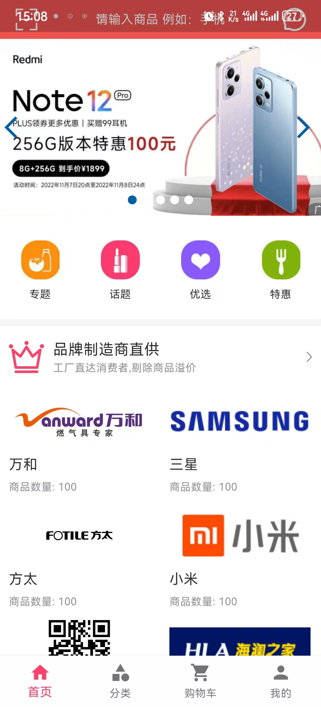
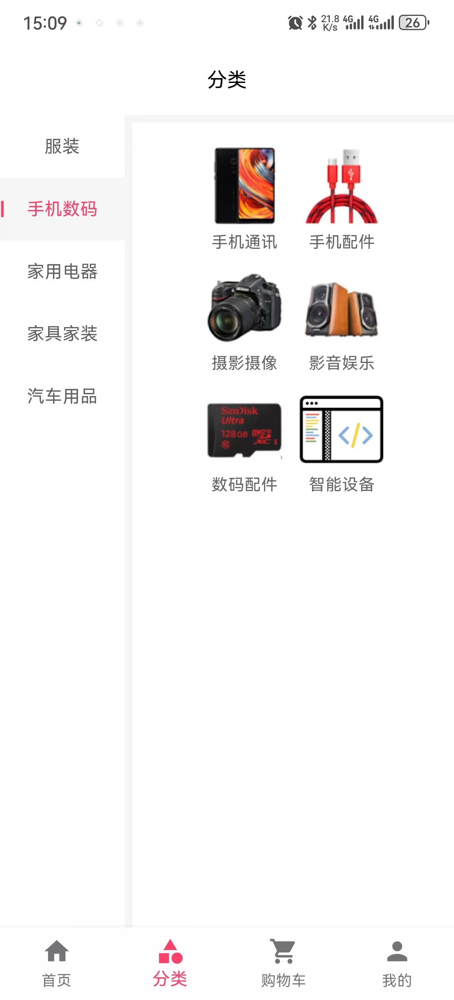
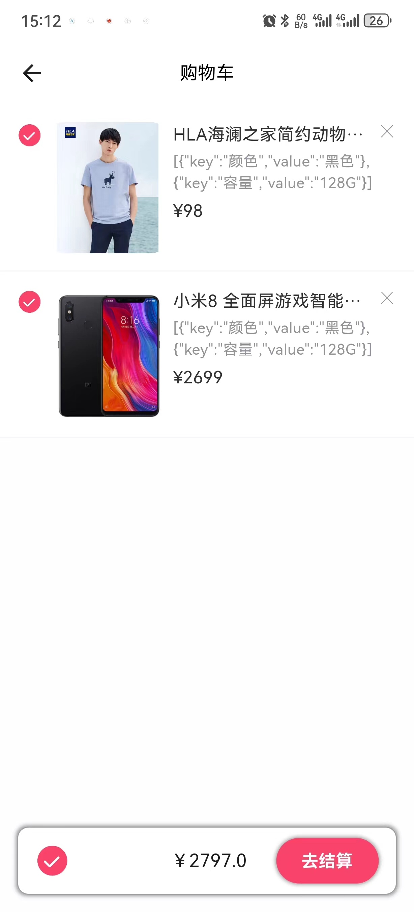
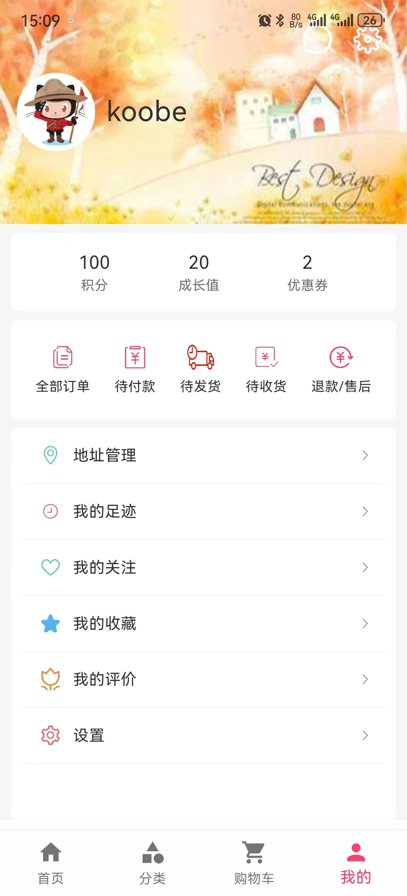
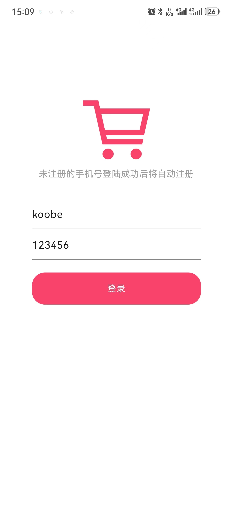
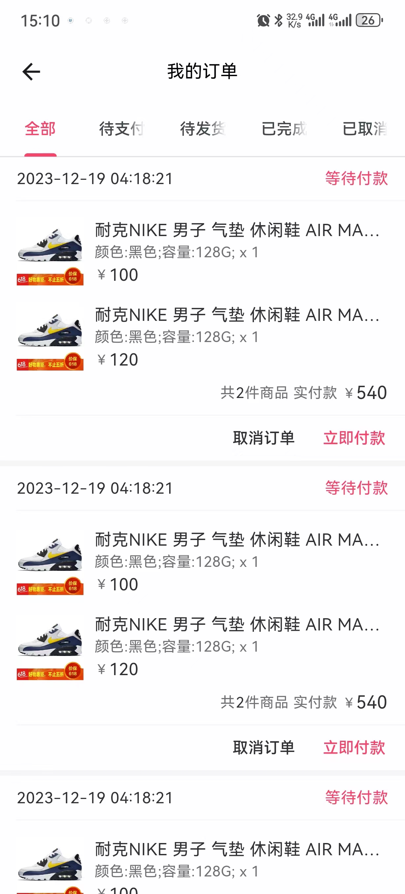
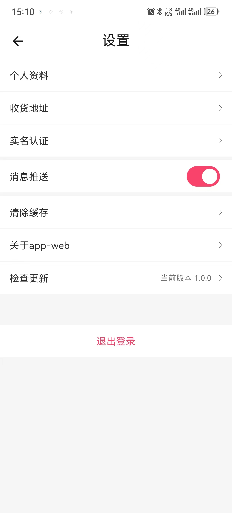

# 九克城 - 移动端电商系统

**九克城** 是一个基于 **Flutter** 框架实现的电商系统移动端项目，旨在提供全面的购物体验。

## 功能模块

1. **首页门户** - 展示热门商品、品牌推荐、秒杀专区、新品推荐等
2. **商品分类** - 支持多级分类浏览和商品搜索
3. **商品详情** - 展示商品信息、规格选择、加入购物车
4. **购物车** - 商品管理、数量调整、批量操作
5. **订单流程** - 下单、支付、物流跟踪、确认收货
6. **会员中心** - 个人信息、积分、优惠券、收藏、足迹等

## 技术栈

- **Flutter** - 跨平台移动应用框架
- **Dart** - 编程语言
- **Provider** - 状态管理
- **Dio** - HTTP 网络请求

## 快速开始

```bash
cd flutter-mall
flutter pub get
flutter run
```

## 应用截图

| 首页 | 分类 | 购物车 | 我的 |
|:---:|:---:|:---:|:---:|
|  |  |  |  |

| 登录 | 订单 | 商品详情 | 设置 |
|:---:|:---:|:---:|:---:|
|  |  |  |  |
